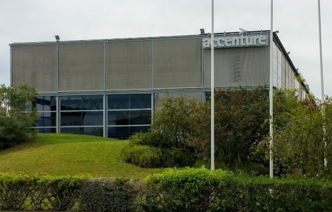

# Índice general del Centro Público Integrado de FP Málaga Tech Park

Información para alumnos del **Centro Público Integrado de FP Málaga Tech Park** (Málaga).

## Índice general

* [Presentacion del CPIFP 29020231](#presentacion-del-CPIFP-29020231)
* [Recogida de datos de alumnos](#recogida-de-datos-de-alumnos)
* [Calendario escolar](#calendario-escolar)
* [Normas de clase](#normas-de-clase)
* [Módulos profesionales](#módulos-profesionales)
* [Horarios](#horarios)
* [Canal de comunicación](#canal-de-comunicación)
* [Perfiles de GitHub](#perfiles-de-github)
* [Diario de trabajo de FP Dual](#diario-de-trabajo-de-fp-dual)
* [Localización](#localización)
* [Enlaces](#enlaces)

## Presentacion del CPIFP 29020231

En la siguiente presentación se muestra la oferta educativa del centro educativo, información sobre las **FCT** (prácticas en empresas) y sobre la **Formación Profesional Dual**.

 [Presentacion del Centro Público Integrado de FP Málaga Tech Park](CPIFP_ENG_v3.pdf)

## Recogida de datos de alumnos
<!--
 -->

[1º SMR](https://docs.google.com/forms/d/e/1FAIpQLSfGbTuWDTrYEgz3cJYkyLT6J-eBfV_CNMtU--Jc7PT1xvoSjA/viewform)

[1º DAW Mañana](https://docs.google.com/forms/d/e/1FAIpQLSdYbGlgxyMsQckK4BEh08LTgM-6bNIcozQ7Nv-_qq7U0TPMHg/viewform) 

[1º DAW Tarde](https://docs.google.com/forms/d/e/1FAIpQLSfghshro4J-1l7g4OqHNQz1_7pI2wdnd1D8DnCgTZAL4fRJpA/viewform)

[1º DAM Mañana](https://docs.google.com/forms/d/e/1FAIpQLSe3rAHzxt0bTpf3xypN6rIpW8STV-8sjdVO3Rv1gx_fIb8xbg/viewform)

[1º DAM Tarde](https://docs.google.com/forms/d/e/1FAIpQLSdi5lPsRgcMRk7m6fn5HfCG31yqL9wjAHhw8EEGCS3MUdd2Lg/viewform)

[1º ASIR](https://docs.google.com/forms/d/e/1FAIpQLSfwG7bw8q72IPCxnYl-vuz3iYdOjTVXX0gYKkFesPUTRzQ-Ag/viewform)

[2º SMR](https://docs.google.com/forms/d/e/1FAIpQLSfj0GDktBpBw4V3IwzDAWwmtAFPq95na_5O6-UdHFAWmXwvvA/viewform)

[2º DAW](https://docs.google.com/forms/d/e/1FAIpQLSdf-uVMmqZ1n_CN8cx4kYtEMt8xBaaVAi0N29ctQyact3aNEA/viewform)

[2º DAM](https://docs.google.com/forms/d/e/1FAIpQLSdNIFSOtWQClFqmSqGIktFm0OpyC06fZOQJZV_mh7sF4s1t7w/viewform)

[CE CIBERSEGURIDAD](https://docs.google.com/forms/d/e/1FAIpQLSfHp9M4xaSSDE14jAn0eOcuZZ1Etausk3feaOBvumnPpShAcQ/viewform)

[CE IA y Big Data](https://docs.google.com/forms/d/e/1FAIpQLSdELYs7usBMLcubwrqK5NLgsuNhoYLshb1IR-FmsBkgClnNYA/viewform)

## Calendario escolar

[Calendario del curso escolar 2022/2023 para Málaga](CALENDARIO22_23.pdf)

## Normas de clase

[Normas de clase y funcionamiento de los Ciclos Formativos en el PTA](normas_y_funcionamientov2.pdf)

## Módulos profesionales

### 1º SMR
* [Aplicaciones Ofimáticas](http://#)
* [Sistemas Operativos](http://#)
* [Montaje y Manimiento](http://#)
* [Redes Locales](http://#)
* [Formación y Orientación Laboral](http://#)

### 1º DAM
* [Bases de Datos](https://iescampanillas.com/aulavirtual/course/view.php?id=24)
* [Entornos de Desarrollo](https://iescampanillas.com/aulavirtual/course/view.php?id=15)
* [Lenguajes de Marcas](https://iescampanillas.com/aulavirtual/course/view.php?id=16)
* [Programación](https://github.com/LuisJoseSanchez/programacion)
* [Sistemas Informáticos](https://iescampanillas.org/aulavirtual/course/view.php?id=22)
* [Formación y Orientación Laboral](http://#)

### 1º DAW
* [Bases de Datos](https://iescampanillas.org/aulavirtual)
* [Entornos de Desarrollo](https://iescampanillas.com/aulavirtual/course/view.php?id=18)
* [Lenguajes de Marcas](https://iescampanillas.com/aulavirtual/course/view.php?id=19)
* [Programación](https://github.com/LuisJoseSanchez/programacion)
* [Sistemas Informáticos](https://iescampanillas.com/aulavirtual/course/view.php?id=22)
* [Formación y Orientación Laboral](http://#)

### 1º ASIR
* [Gestión de Bases de Datos](http://#)
* [Fundamentos de Hardware](http://#)
* [Planificación y Administración de Redes](http://#)
* [Implantación d eSistemas Operativos](http://#)
* [Lenguajes de Marcas y Sistemas de Gestión](http://#)
* [Formación y Orientación Laboral](http://#)

### 2º DAM
* [Acceso a datos](https://github.com/LuisJoseSanchez/ionic)
* [Programación de servicios y procesos](http://iescampanillas.com/moodle/course/view.php?id=69)
* [Programación multimedia y de dispositivos móviles](http://iescampanillas.com/moodle/course/view.php?id=68)
* [Horas de Libre Configuración (English)](http://iescampanillas.com/moodle/course/view.php?id=44)
* [Empresa e Iniciativa Emprendedora](http://#)
* [Sistemas de gestión de empresas](https://classroom.google.com/u/0/w/Mzg5MzMzNTQ5NjU0/t/all)

### 2º DAW
* [Desarrollo Web en Entorno Cliente](https://classroom.google.com/u/0/w/MzcxMzg4MDE0NzQ1/t/all)
* [Desarrollo Web en Entorno Servidor](http://iescampanillas.com/moodle/course/view.php?id=62)
* [Despliegue de Aplicaciones Web](https://iescampanillas.com/aulavirtual/course/view.php?id=9)
* [Diseño de Interfaces WEB](http://iescampanillas.com/moodle/course/view.php?id=15)
* [Horas de Libre Configuración (English)](https://classroom.google.com/u/0/c/Mzg5NTE4NTEyMzgw)
* [Empresa e Iniciativa Emprendedora](http://#)

### 2º SMR
* [Apliciones Web](http://#)
* [Seguridad Informática](http://#)
* [Servicios en Red](http://#)
* [Sistemas Operativos en Red](http://#)
* [Horas Horas de Libre Configuración](http://#)
* [Empresa e Iniciativa Emprendedora](http://#)

### CURSO DE ESPECIALIZACIÓN EN CIBERSEGURIDAD
* [Análisis Forense](https://iescampanillas.com/aulavirtual/course/view.php?id=67)
* [Bastionado de Redes y Si.](http://#)
* [Hacking Ético](http://#)
* [Incidentes de Ciberseguridad](http://#)
* [Normativa de Ciberseguridad](http://#)
* [Puesta en Producción Seg.](http://#)

### CURSO DE ESPECIALIZACIÓN EN INTELIGENCIA ARTIFICIAL Y BIG DATA
* [Modelos de Inteligencia Artificial](http://#)
* [Sistemas de aprendizaje automático](http://#)
* [Programación de Inteligencia Artificial](http://#)
* [Sistemas de Big Data](http://#)
* [Big Data aplicado](http://#)

## Horarios

### 1º DAM

| Lunes | Martes | Miércoles | Jueves | Viernes |
| :---: | :---:  |   :---:   | :---:  |  :---:  |
|  PRO  |  SINF  |   ED      |  PRO   |  FOL    |
|  PRO  |  SINF  |   ED      |  PRO   |  FOL    |
|  LM   |  SINF  |   PROG    |  LM    |  FOL    |
|  LM   |  PRO   |   PROG    |  LM    |  SINF   |
|  BBDD |  PRO   |   BBDD    |  BBDD  |  SINF   |
|  BBDD |  ED    |   BBDD    |  BBDD  |  SINF   |

ED: Entornos de Desarrollo. Antonio Ortega González.

PRO: Programación. Juan antonio García Gómez.

BBDD: Bases de Datos. Eva Mª Perales Belizón.

LM: Lenguajes de Marcas y Sistemas de Gestión de Información. Pilar González Augusto.

SINF: Sistemas Informáticos. Prof. Nuevo.

FOL: Formación y Orientación Laboral. Rosa Carmen Alcázar

### 1º DAW

| Lunes | Martes | Miércoles | Jueves | Viernes |
| :---: | :---:  |   :---:   | :---:  |  :---:  |
|  PROG |  SINF  |   BBDD    |  PROG  |   SINF  |
|  PROG |  SINF  |   BBDD    |  PROG  |   SINF  |
|  ED   |  SINF  |   BBDD    |  PROG  |   SINF  |
|  ED   |  BBDD  |   PROG    |  ED    |   FOL   |
|  LM   |  BBDD  |   PROG    |  LM    |   FOL   |
|  LM   |  BBDD  |   PROG    |  LM    |   FOL   |

SINF: Sistemas Informáticos. Gregorio Coronado Morón.

FOL: Formación y Orientación Laboral. Isabel Gregory chicano.

PRO: Programación. María Dolores. Jiménez.

BBDD: Bases de Datos. Eva Mª Perales.

LM: Lenguajes de Marcas y Sistemas de Gestión de Información. Pilar González Augusto.

ED: Entornos de Desarrollo. Prof. Nuevo.

### 2º DAM

| Lunes | Martes  | Miércoles | Jueves | Viernes |
| :---: | :---:   |   :---:   | :---:  |  :---:  |
|  PRO  |  AD     |   PRO     |  PRO   |  HLC    |
|  PRO  |  AD     |   PRO     |  PRO   |  HLC    |
|  SGE  |  AD     |   PRO     |  AD    |  HLC    |
|  SGE  |  EIEM   |   DI      |  AD    |  EIEM   |
|  DI   |  DI     |   DI      |  SGE   |  EIEM   |
|  DI   |  DI     |   DI      |  SGE   |  EIEM   |

AD: Acceso a Datos. Juan Antonio García Gómez.

EIEM: Empresa e Iniciativa Emprendedora. Rosa Carmen Alcázar Rosa.

PRO: Programación Multimedia y de Dispositivos Móviles, Programación de Servicios y Procesos. Antonio J. Sánchez.

DI: Diseño de Interface. José David Quero Sánchez.

SGE: Sistemas de Gestión Empresarial. Miguel Ángel Ronda Carracao.

HLC: Horas de Libre Configuración. Juan Antonio García Gómez.

### 2º DAW (pendiente de actualizar)

| Lunes | Martes | Miércoles | Jueves | Viernes |
| :---: | :---:  |   :---:   | :---:  |  :---:  |
|  DAW  |  DWEC  |   DWES    |  DWEC  |  HLC    |
|  DAW  |  DWEC  |   DWES    |  DWEC  |  HLC    |
|  DAW  |  DWEC  |   DWES    |  DWEC  |  HLC    |
|  DWES |  DI    |   EIEM    |  DWES  |  EIEM   |
|  DWES |  DI    |   DI      |  DWES  |  EIEM   |
|  DWES |  DI    |   DI      |  DI    |  EIEM   |

EIEM: Empresa e Iniciativa Emprendedora. Isabel María Gregory Chicano

DWES: Desarrollo Web en Entorno Servidor. Antonio J. Sánchez.

DI: Diseño de Interface. Moisés Martínez.

DAW: Despliegue de Aplicaciones Web. Javier Morillas Zafra

DWEC: Desarrollo Web en Entorno Cliente. José Juan García Mayorga.

HLC: Horas de Libre Configuración. José Juan García Mayorga.

### CURSO DE ESPECIALIZACIÓN EN INTELIGENCIA ARTIFICIAL Y BIG DATA

| Lunes | Martes    | Miércoles  | Jueves | Viernes |
| :---: | :---:     |   :---:    | :---:  |  :---:  |
|  IA   |  IA       |   IA       |  IA    |         |
|  MIA  |  IA       |   IA       |  IA    |         |
|  MIA  |  Big Data |   Big Data |  IA    |         |
|  MIA  |  Big Data |   Big Data |  IA    |         |
|       |  Big Data |   Big Data |  IA    |         |
|       |  Big Data |            |        |         |

MIA: Modelos de Inteligencia Artificial. Eva Mª Perales Belzón

IA: Sistemas de aprendizaje automático y Programación de Inteligencia Artificial. Luis José Sánchez González

Big Data: Sistemas de Big Data y Big Data aplicado. Miguel Ángel Ronda Carracao.

## Canal de comunicación

##  :octocat: Perfiles de GitHub

### Grupo CPIFP Nuevo - 29020231

[Perfil del grupo CPIFP Nuevo - 29020231](https://github.com/CPIFP-29020231)

### Profesores

[Luis José Sánchez](https://github.com/LuisJoseSanchez)

[Eva María Perales Belizón](https://github.com/evaperales) 

[José Juan García Mayorga](https://github.com/josejuanmayorga)

[Juan Antonio García Gómez](https://github.com/juanarrow)

Javier Morillas Zafra

[Juan Antonio Jiménez](https://github.com/profesorjim) 

[Antonio José Sánchez](https://github.com/bilbobolson) 

[Pilar Gónzalez Augusto](https://github.com/PilarIESCampanillas)

Isabel Gregory Chicano

### Alumnos

#### DAW

[Perfiles de GitHub de alumnos de DAW de la promoción 2020 - 2022](https://github.com/IESCampanillas/github-alumnos-daw-20-22)

[Perfiles de GitHub de alumnos de DAW de la promoción 2019 - 2021](https://github.com/IESCampanillas/github-alumnos-daw-1921)

[Perfiles de GitHub de alumnos de DAW de la promoción 2017 - 2019](https://github.com/LuisJoseSanchez/github-alumnos-daw-1719)

#### DAM

[Perfiles de GitHub de alumnos de DAM de la promoción 2021 - 2023](https://github.com/IESCampanillas/github-alumnos-dam-21-23)

[Perfiles de GitHub de alumnos de DAM de la promoción 2020 - 2022](https://github.com/IESCampanillas/github-alumnos-dam-20-22)

[Perfiles de GitHub de alumnos de DAM de la promoción 2019 - 2021](https://github.com/IESCampanillas/github-alumnos-dam-1921)

[Perfiles de GitHub de alumnos de DAM de la promoción 2018 - 2020](https://github.com/IESCampanillas/github-alumnos-dam-1820)

[Perfiles de GitHub de alumnos de DAM de la promoción 2017 - 2019](https://github.com/LuisJoseSanchez/github-alumnos-dam-1719)

## Diario de trabajo de FP Dual

:notebook: <http://diario.iescampanillas.com>

## Proyecto final

Las instrucciones para la realización del proyecto final de DAM están en el siguiente repositorio:

:octocat: <https://github.com/IESCampanillas/proyectos-dam-2019>

## Localización

[C/ Frederick Terman,3. 29590, PTA](https://goo.gl/maps/LU6FGYA9KgG2EF947)

[Curso de especialización de Videojuegos: Av de Sor Teresa Prat, 15, 29003 Málaga](https://goo.gl/maps/EqTUhpbXWf9n5Aaz9)

[Curso de especialización de Inteligencia Artificial y Big: C/ Severo Ochoa, 21, 29590, PTA](https://goo.gl/maps/3Ucnoz9zNxhPjxRc8)

## Enlaces
Mientras no esté disponible la web oficial del CPIFP Nuevo - 29020231, temporalmente se publicaran las noticias en la web del IES Campaillas.

[IES Campanillas (web oficial)](http://iescampanillas.com/)

Web del CE en Inteligencia Artificial y Big Data:
[MasterIABD.com](https://masteriabd.com/)

:star: Si te ha gustado este repo, dale una estrellita :wink:
